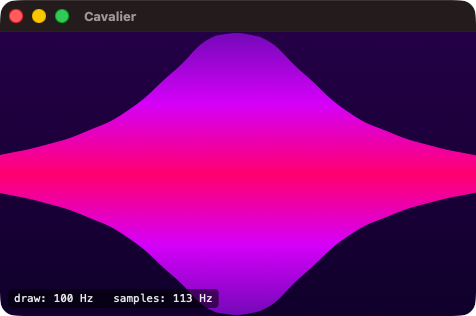

# Cavalier for macOS (zman edition)

<p align="center">
  
</p>

A native macOS music visualizer. Independent Swift rewrite of [Nickvision Cavalier](https://github.com/NickvisionApps/Cavalier) — no CAVA, no BlackHole, no Homebrew dependencies. Uses Core Audio's process tap API to capture system audio directly.

Bundle ID: `com.zman.cavalier`.

## Install (prebuilt DMG)

Grab the latest `.dmg` from [Releases](../../releases), drag **Cavalier** into **Applications**, then — because the build is ad-hoc signed and not notarized — run this once to let it launch:

```sh
xattr -dr com.apple.quarantine /Applications/Cavalier.app
```

Without this step Gatekeeper will show *"Cavalier can't be opened"* or *"Cavalier is damaged"*. The xattr command only removes the quarantine flag set by Safari/AirDrop; it doesn't disable other security checks.

## Credits

- Original Cavalier (GTK / .NET): © 2023 Fyodor Sobolev and the Nickvision contributors, MIT licensed. See `LICENSE.upstream`.
- macOS rewrite (this repository): separate codebase in Swift/SwiftUI, written from scratch against the original's public algorithms and UX. Not affiliated with Nickvision.

## Requirements

- macOS 14.4 or newer (Core Audio process tap requires 14.2+; some entitlement behavior stabilized in 14.4)
- Xcode 15+
- [XcodeGen](https://github.com/yonaskolb/XcodeGen) — `brew install xcodegen`

## Build & run

```bash
xcodegen generate
open Cavalier.xcodeproj
# or headless:
xcodebuild -project Cavalier.xcodeproj -scheme Cavalier -configuration Debug build
```

The `.xcodeproj` is regenerated from `project.yml` and is git-ignored — only commit `project.yml` and the Swift sources.

## Architecture

- `Audio/SystemAudioTap.swift` — Core Audio process tap + aggregate device; captures stereo Float32 @ 48 kHz.
- `Audio/AudioProcessor.swift` — Hann window → vDSP FFT → log-spaced bin grouping → autosens/sensitivity → temporal smoothing (noise reduction) → Monstercat spread.
- `Audio/VisualizerEngine.swift` — framerate-paced pull from the ring buffer; publishes `latestBars` via `@Observable`.
- `Audio/UDPBarSink.swift` — optional, opt-in. When *Broadcast spectrum to localhost* is enabled in **Preferences → Audio**, mirrors each bar frame to `udp://127.0.0.1:7777` for external consumers (see `keyboard-bridge/`). Off by default — enabling it makes audio-derived data readable by any local process on that port.
- `Rendering/` — pure `CGContext` drawing, one file per mode.
- `Views/VisualizerView.swift` — `NSView` driven by `CVDisplayLink` for vsync-locked redraws.

Config is persisted to `~/Library/Application Support/Cavalier/config.json`.

## Keyboard bridge (optional)

`keyboard-bridge/` is a small Bun tool that drives a Keychron V6's RGB LEDs in
sync with Cavalier — per-key hue sampled from the app's active `fgColors`
gradient, saturation driven by the spectrum. Zero firmware flashing (rides
Keychron's stock vendor HID protocol). See
[`keyboard-bridge/README.md`](keyboard-bridge/README.md).

## License

MIT. See `LICENSE`.
